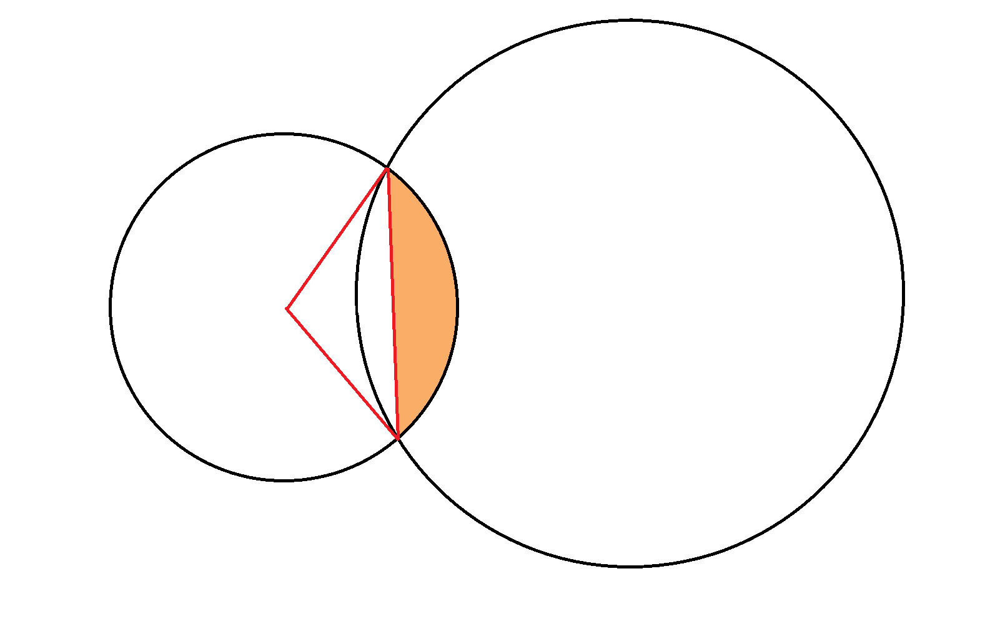
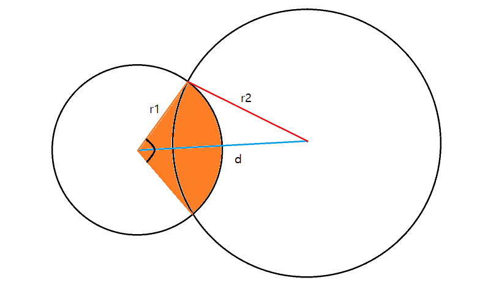
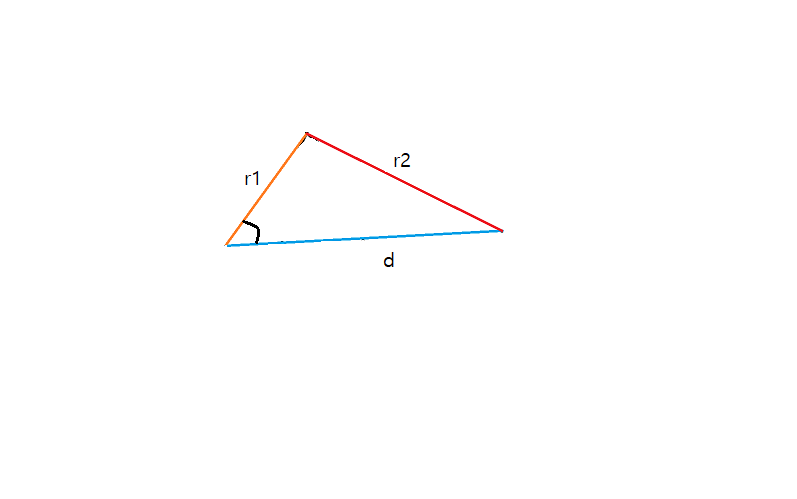
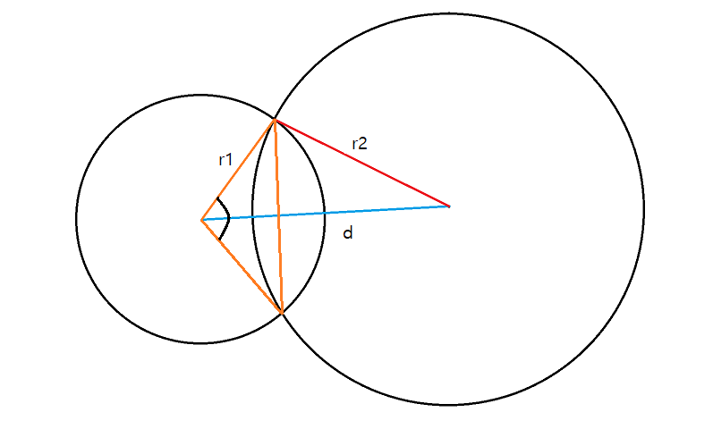

# BOJ 7869 두 원
 

### 난이도 : 골드 3
[문제 보러가기](https://www.acmicpc.net/problem/7869)

중학교 수준의 기하학 문제였습니다.

## 기하
메모리 	1276KB, 시간 0ms


## 풀이

원의 중심끼리의 거리를 구할 수 있고, 두 원의 반지름의 길이의 합을 이용하여 두 원의 인접 상태를 알 수 있습니다.  

1. 원이 겹쳐있지 않은 경우 구하는 넓이는 0.000입니다. 
2. 한 원이 다른 원에 완전히 포함된 경우 구하는 넓이는 작은 원의 넓이입니다.

3. 원의 일부분끼리 겹친 경우는 제2코사인법칙을 이용하여 풀 수 있습니다.


3-1. 구하는 부분은 부채꼴에서 삼각형을 뺀 꼴임을 확인할 수 있습니다.  


3-2. 부채꼴의 넓이를 구하기 위해서는 사잇각을 알아야 합니다.  


3-3. 아는 길이들로 이루어진 그림의 삼각형에서, 구하는 각은 부채꼴의 사잇각의 절반임을 알 수 있습니다.  


3-4. 주황색 삼각형의 넓이는 사잇각의 ```sin```값을 이용하여 구할 수 있습니다.


## ```std::acos()```
```<cmath>```헤더에 있으며, [-1,1]의 값을 입력받아 **라디안 값**을 반환하며, 범위를 벗어나는 값에 대해서는 NaN을 반환합니다.  

## 느낀 점
원주율 pi에 잘못된 값을 집어넣었다가 한참 시행착오를 겪었습니다.  
플랫폼에 구애받지 않는 참값을 이용하는 습관을 가집시다...


## 코드 보러가기
[코드](./boj7869.cpp)