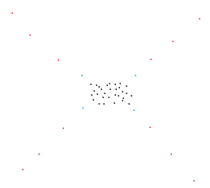

# 백준 12002 Field Reduction (Silver) 
 

### 난이도 : 골드 3

[문제 보러가기](https://www.acmicpc.net/problem/12002)
  

## 정렬, 브루트 포스
메모리 2808kb, 시간 24ms

## 해설  
N개의 좌표 중 최대 3개를 제외하고 나머지 좌표들을 모두 둘러싸는(경계 포함) 직사각형을 만들 때, 만들 수 있는 최소 넓이를 구하는 문제입니다.  
N이 꽤 크기 때문에 이 중 3개를 선택하는 N_C_3으로는 시간 내에 풀 수 없습니다.  
그렇기 때문에 직사각형의 넓이에 변화를 만드는 좌표가 누구인가 생각해 보고, 그 대상들만 경우의 수로 판별해야 하는 insight가 필요한 문제였습니다.  

  

위 그림에서, 빨간 점은 x좌표나 y좌표가 최대/최소인 점이고, 이 점들이 바뀌었을 때 직사각형의 넓이에 영향을 끼칩니다.  
점을 3개까지 제거할 수 있기 때문에 그 다음으로 최대/최소인 파란 점들까지 경우의 수 범위에 넣고 진행하면 풀 수 있습니다.  
16개 점 중에서 경계선을 설정한 후 빠져나간 점이 3개 이하일 때, 최소 넓이를 구하는 식으로 구현했습니다.

## 느낀 점
스터디 첫 외국어 문제. 영어보다는 구현이 어렵다고 느꼈습니다.

## 전체 코드
[코드 보러가기](./boj12002.cpp)
